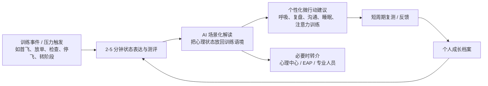

# 飞颜心测（MindFlight）竞品调研决策主文档

版本：v0.1  
日期：2026-07-08  
用途：支持第一阶段 MVP 差异化定位与下一阶段核心能力投入决策  

---

## 1. 一句话结论

飞颜心测不应定位为“飞行员版心理咨询 App”，也不应在 MVP 阶段做成泛心理社区或心理服务平台。

更清晰的第一阶段定位是：

> 面向飞行学员与新人飞行员的 AI 心理成长支持平台：围绕真实训练压力场景，提供低门槛表达、循证测评、AI 解读、微行动建议与成长记录，并在必要时连接院校心理中心 / 航司 EAP / 专业人员。

这意味着飞颜心测的差异化不在于“有没有 AI 聊天”或“有没有预约咨询”，而在于：

1. 是否真正理解飞行训练场景；
2. 是否能把心理状态转化为可执行的成长动作；
3. 是否能形成连续成长档案，而不是一次性测评报告；
4. 是否能在组织场景中建立可信的数据边界与非惩罚性机制。

---

## 2. 本次调研要回答的产品决策问题

本次竞品调研不是为了做功能清单，而是为了回答三个决策问题：

| 决策问题 | 需要得到的答案 |
|---|---|
| 飞颜心测第一阶段 MVP 应该和谁竞争？ | 不是与所有心理 App 竞争，而是与“院校 / 航司已有心理支持体系的低频、滞后、难触达问题”竞争。 |
| MVP 的差异化应该落在哪里？ | 落在“飞行训练场景化 + AI 成长陪伴 + 循证测评闭环 + 人工支持连接”上。 |
| 下一阶段应该优先投入什么？ | 优先投入训练场景 AI 支持、测评-解读-行动-复测闭环、风险识别与转介边界、个人成长档案；社区与服务平台后置。 |

---

## 3. 竞品格局：不是单一赛道，而是四类力量

飞颜心测面对的不是一个清晰的“航空心理 App”市场，而是四类不同力量的交叉竞争。

| 类型 | 代表对象 | 它们强在哪里 | 对飞颜心测的威胁 | 对飞颜心测的启发 |
|---|---|---|---|---|
| 航空垂直心理 / 健康工具 | AvHealth | 航空语境、飞行员心理健康资源、轻量自助工具 | 证明“航空人群心理支持”已经有人做，但产品深度和组织嵌入仍有限 | 飞颜心测必须比它更懂训练全过程，而不是只做资源工具箱 |
| 航空人工支持体系 | Meliora、院校心理中心、航司 EAP | 保密、同行支持、专业人员、危机处置、组织合法性 | 它们是最现实的替代方案，也是未来 To B 买方已有系统 | 飞颜心测应做数字化前端和日常成长层，而不是替代心理中心 |
| AI 心理支持平台 | Wysa | 匿名 AI 入口、结构化 CBT 工具、企业 / 医疗路径、证据建设 | AI 体验与证据体系成熟度更高 | 飞颜心测要学习“AI + 自助工具 + 人工转介”的分层服务，而不是把 AI 包装成治疗师 |
| 国内泛心理 / 咨询服务平台 | 壹心理、简单心理 | 流量、内容、咨询师供给、服务治理、To B 交付 | 在心理服务供给和用户心智上更成熟 | 飞颜心测应借鉴服务治理，不应复制泛心理平台或咨询 marketplace |
| 航空训练行为科技 | AeroMind | 训练数据、行为识别、教员复盘、CBTA/EBT 语境 | 可能占据“心理状态与训练表现数字化”的机构预算 | 飞颜心测要坚持学习者成长支持，避免变成监控 / 评价工具 |
| 行业最佳实践 / 监管原则 | CAAC、EASA、FAA | 非惩罚性、保密、同行支持、复飞支持、心理安全文化 | 它们定义了组织采购与合规接受的底线 | 飞颜心测必须从第一天设计数据边界、危机转介和非惩罚性机制 |

---

## 4. 关键判断一：飞颜心测最该竞争的不是“心理咨询”，而是“训练压力无人承接”

### 4.1 当前用户真正的问题

飞行学员和新人飞行员的心理压力并不总是以“我要咨询”的形式出现。更多时候，它表现为：

- 首飞、放单、转阶段、检查、航司选拔前后的持续焦虑；
- 被教员否定、训练表现波动后的自我怀疑；
- 害怕被记录、害怕影响训练评价，所以不愿主动寻求帮助；
- 不知道自己的压力是正常训练反应，还是需要专业支持；
- 即使院校有心理中心，也常常不知道什么时候该去、怎么说、是否会被看见。

因此，飞颜心测 MVP 的核心任务不是“提供更多心理服务入口”，而是填补一个更具体的空白：

> 在学生还没走到咨询室之前，给他一个安全、低压、可持续的心理成长入口。

### 4.2 对应的产品机会

飞颜心测应该把自己设计成“训练压力的第一接触点”：

1. 用户可以先匿名或半匿名表达；
2. AI 帮助识别当前状态与训练事件的关系；
3. 测评给出相对稳定的状态参照；
4. 系统给出可执行的微行动，而非泛泛安慰；
5. 必要时引导用户连接心理中心 / EAP / 专业人员；
6. 长期沉淀个人成长曲线。

---

## 5. 关键判断二：MVP 差异化应建立在“飞行训练场景化闭环”

如果飞颜心测只做 AI 聊天，会被 Wysa 等成熟 AI 心理平台压制；如果只做心理咨询入口，会被壹心理、简单心理和院校心理中心替代；如果只做测评，会很容易变成一次性工具。

真正有差异化的 MVP 闭环应是：

这个闭环的本质不是功能堆叠，而是一个持续成长系统：

- 测评不是终点，而是进入 AI 解读和行动建议的依据；
- AI 不是闲聊机器人，而是训练场景中的心理教练；
- 成长档案不是静态报告，而是帮助用户看见“我正在变稳”的证据；
- 转介不是失败，而是平台可信度的一部分。

---

## 6. 关键判断三：社区可以做，但不应成为 MVP 的主轴

用户提出的“带有匿名聊天社区的各种心理服务分享平台”有价值，但需要拆分。

### 6.1 建议保留的部分

建议进入 P1 的是：

> 面向飞行学员的匿名成长互助社区 / 结构化匿名经验分享。

它的价值在于：

- 降低“只有我不行”的孤独感；
- 让学员看到同阶段他人的真实经验；
- 将心理成长从个人问题转化为训练成长的一部分；
- 为平台提供高频访问理由。

更适合的形态不是开放式闲聊广场，而是结构化主题：

- “我第一次单飞前的状态”
- “检查前一周怎么稳住”
- “被教员批评后如何复盘”
- “停飞 / 补训阶段如何调整”
- “航司面试前的压力管理”

### 6.2 MVP 阶段不建议做的部分

不建议在 MVP 阶段做：

- 开放匿名实时聊天室；
- 泛心理服务分享平台；
- 心理咨询师 / 服务交易 marketplace；
- 面向院校管理者的个体心理风险排行；
- 把社区内容与训练评价或纪律管理绑定。

原因很简单：这些能力会快速引入审核、危机干预、隐私、专业资质、交易治理与组织信任问题，超出第一阶段 MVP 的验证重点。

---

## 7. 竞品对飞颜心测的战略启发

| 对象 | 最值得学习 | 不建议照搬 | 对飞颜心测的参考价值 | 优先研究 |
|---|---|---|---|---|
| AvHealth | 航空语境、轻量工具、资源整合 | 做成航空心理资源工具箱 | ★★★★☆ | P0 |
| Meliora | 同行支持、保密机制、复飞 / 持续陪伴 | 纯人工服务体系 | ★★★★★ | P0 |
| Wysa | 匿名 AI 入口、结构化心理工具、证据建设、分层转介 | 把 AI 包装成万能治疗师 | ★★★★★ | P0 |
| 壹心理 | 内容-测评-咨询-企业服务的生态连接 | 泛心理流量平台打法 | ★★★★★ | P0 |
| 简单心理 | 咨询师质量治理、匹配、督导与投诉机制 | 第一阶段自建咨询 marketplace | ★★★★☆ | P1 |
| 院校心理中心 / 航司 EAP | 组织合法性、预约、危机处置、线下专业支持 | 重复建设预约系统或替代心理中心 | ★★★★★ | P0 |
| AeroMind | 训练数据化、教员复盘、行为证据 | 情绪识别监控、心理评分、管理侧风险排名 | ★★★★☆ | P1 |
| CAAC + EASA/FAA | 非惩罚性、保密、同行支持、复飞支持、心理安全文化 | 把合规原则简化为“风险筛查” | ★★★★★ | P0 |

---

## 8. MVP 能力优先级建议

### P0：第一阶段必须投入

| 能力 | 为什么是 P0 | 产品形态建议 |
|---|---|---|
| 飞行训练场景化 AI 对话 | 决定差异化。如果只是泛心理聊天，没有护城河 | 围绕首飞、放单、检查、转阶段、停飞、航司选拔等场景设计对话模板与提示策略 |
| 心理测评 + AI 解读闭环 | 当前已有测评和 AI 解读，是最自然的 MVP 主链路 | 每次测评后输出“状态解释 + 训练影响 + 3 个微行动” |
| 个性化成长建议 | 用户真正需要的是下一步怎么做，而不是知道自己焦虑 | 建议以 3-7 天可执行任务为主，如睡眠、复盘、呼吸、沟通、注意力练习 |
| 成长记录 / 成长档案轻量版 | 形成复访理由，也构成 To B 价值 | 先做个人可见的趋势、事件、行动完成度，不做管理侧个体排行 |
| 风险识别与人工转介边界 | 心理产品的信任底线，也是 To B 必问项 | 明确危机提示、热线 / 心理中心 / EAP 转介、免责声明与人工支持入口 |
| 数据边界与非惩罚性机制 | 航空心理场景极敏感，若用户担心影响训练评价，会直接不敢用 | 默认个人数据个人可见；组织侧只看匿名聚合；个体授权后才可分享摘要 |

### P1：验证后投入

| 能力 | 为什么是 P1 | 产品形态建议 |
|---|---|---|
| 结构化匿名成长社区 | 有助于提高频率和归属感，但审核与安全成本较高 | 先做主题帖、经验卡片、精选故事、同阶段共鸣，而非开放聊天室 |
| 与院校心理中心预约系统对接 | 预约本身不是差异化，但连接现有服务很重要 | 若院校已有系统，做跳转 / 预约前整理 / 咨询后跟进 |
| 教员 / 辅导员支持材料 | 有助于 To B 落地，但要避免监控感 | 只提供聚合趋势、课程建议、心理健康教育素材 |
| 训练阶段化内容库 | 增强专业感与留存 | 按理论阶段、初教机、单飞、仪表、商照、航司新人等组织 |

### P2：暂缓投入

| 能力 | 暂缓原因 |
|---|---|
| 开放匿名实时聊天室 | 安全、审核、危机干预压力大，容易失控 |
| 心理服务交易 marketplace | 会把产品拖入供给治理、资质审核、投诉、分成等复杂问题 |
| 面向管理者的个体风险看板 | 极易破坏用户信任，并与非惩罚性原则冲突 |
| 复杂院校后台 | MVP 阶段先验证学员侧价值和聚合洞察，不宜过早重后台 |
| 情绪识别 / 微表情监控 | 与飞颜心测“成长支持”定位冲突，容易产生监控感 |

---

## 9. 建议的 MVP 版本定义

### 9.1 MVP 核心用户

第一阶段建议优先服务：

1. 飞行院校理论阶段后期到飞行训练阶段学员；
2. 正处于关键训练节点的学员：首飞、放单、检查、转阶段、补训、停飞后恢复；
3. 航司新人飞行员可作为第二类验证对象。

不建议第一阶段面向所有航空从业者展开。

### 9.2 MVP 核心场景

建议优先做 4 个高压、高频、强差异化场景：

| 场景 | 用户痛点 | 平台应提供的价值 |
|---|---|---|
| 检查 / 考核前 | 焦虑、睡眠差、担心失败 | 压力识别、考前稳定策略、注意力训练 |
| 被教员批评后 | 自我怀疑、羞耻感、抗拒训练 | 情绪整理、复盘框架、沟通建议 |
| 首飞 / 放单前后 | 兴奋与恐惧交织、担心失误 | 正常化解释、风险感知、行动清单 |
| 训练波动 / 补训 / 停飞 | 低自我效能、担心职业前途 | 成长轨迹、复原力训练、必要时转介 |

### 9.3 MVP 不做什么

第一阶段明确不做：

- 不做泛心理内容社区；
- 不做心理咨询平台；
- 不做教员 / 院校监控工具；
- 不做精神疾病诊断；
- 不做“AI 治疗师”承诺；
- 不做个体心理风险评分上报。

这几条边界非常重要。它们不是限制想象力，而是保护产品信任。

---

## 10. To B 价值主张建议

面向飞行院校和航司时，飞颜心测不应主打“发现风险学生”，而应主打：

> 帮助组织建立低门槛、非惩罚性、可持续的飞行学员心理成长支持体系。

更适合的 To B 价值表达：

| 买方关心 | 飞颜心测的回答 |
|---|---|
| 学员心理压力大，但不愿求助 | 提供低门槛 AI 入口，降低表达成本 |
| 心理中心人手有限 | AI 承接日常轻量支持，把严重或持续问题转给人工 |
| 管理者想知道整体状态 | 提供匿名聚合趋势，而不是个体监控 |
| 航空训练安全需要心理支持 | 将心理成长嵌入训练节点和复盘流程 |
| 担心隐私和责任 | 建立清晰数据授权、危机转介和非惩罚性原则 |

---

## 11. 建议的产品路线图

### 阶段 1：MVP 验证，8-12 周

目标：验证飞行训练场景化 AI 支持是否能带来真实使用价值。

建议交付：

- 4 个训练压力场景；
- 2-3 个循证测评量表或状态检查；
- AI 解读与成长建议；
- 个人成长记录轻量版；
- 危机提示与人工转介；
- 匿名聚合后台雏形。

核心指标：

- 测评完成率；
- AI 解读阅读率；
- 微行动采纳率；
- 7 日 / 14 日复访率；
- 用户是否愿意在关键训练节点主动使用；
- 用户是否认为平台“懂飞行训练”。

### 阶段 2：组织试点，3-6 个月

目标：验证 To B 价值和组织接受度。

建议交付：

- 与 1-2 所院校或训练机构试点；
- 学员侧持续成长档案；
- 心理中心 / 辅导员转介协作流程；
- 匿名聚合趋势报告；
- 结构化匿名成长社区试点。

核心指标：

- 试点激活率；
- 关键训练节点覆盖率；
- 人工咨询前整理使用率；
- 学员隐私信任评分；
- 组织续约 / 扩点意愿。

### 阶段 3：平台化扩展，6-12 个月

目标：从单点工具走向航空心理成长平台。

可能扩展：

- 航司新人飞行员模块；
- 教员 / 辅导员心理支持工具包；
- 专业人员协作后台；
- 多阶段内容库；
- 更完善的匿名互助社区；
- 与 EAP / 心理中心 / 培训系统对接。

---

## 12. 风险与反原则

| 风险 | 如果处理不好会怎样 | 建议原则 |
|---|---|---|
| 被理解为监控工具 | 学员不敢说真话，平台失去核心价值 | 个人优先、授权分享、组织看聚合 |
| AI 过度承诺 | 引发专业与伦理风险 | AI 做支持、解释、建议与转介，不做诊断和治疗承诺 |
| 社区失控 | 负面情绪扩散、危机内容难处理 | 先结构化、半开放、强审核 |
| To B 买方只想要风险筛查 | 产品被带偏成管理工具 | 坚持成长支持和非惩罚性定位 |
| 复制泛心理平台 | 失去航空场景差异化 | 所有核心功能都必须回到训练事件 |

---

## 13. 当前建议的最终决策

建议将飞颜心测第一阶段 MVP 定义为：

> 飞行训练场景中的 AI 心理成长支持 MVP。

第一阶段产品主链路：

> 训练压力事件 → 状态表达 / 测评 → AI 场景化解读 → 微行动建议 → 成长记录 → 必要时人工转介。

第一阶段优先投入：

1. 训练场景化 AI 对话；
2. 测评-解读-行动-复测闭环；
3. 个人成长档案轻量版；
4. 风险识别与人工转介；
5. 数据边界与非惩罚性机制。

第一阶段暂缓：

1. 开放匿名聊天室；
2. 泛心理服务分享平台；
3. 咨询师 marketplace；
4. 管理者个体风险看板；
5. 微表情 / 情绪识别监控。

---

## 14. 下一步需要验证的关键假设

| 假设 | 验证方式 |
|---|---|
| 飞行学员愿意在训练压力节点使用 AI 心理支持 | 访谈 + 原型测试 + 小范围试点 |
| 用户认为“飞行训练场景化”比泛心理聊天更有价值 | 对比测试：通用 AI 心理建议 vs 飞行场景化建议 |
| 测评 + AI 解读 + 微行动能形成复访 | 7 日 / 14 日留存与行动完成率 |
| 学员愿意记录成长，但不愿被院校直接查看 | 隐私边界概念测试 |
| 院校 / 航司愿意为匿名聚合趋势与低门槛支持付费 | To B 访谈 + 试点方案报价测试 |
| 匿名成长社区能增加归属感但不制造风险 | 小范围白名单社区试点 |

---

## 15. 公开资料参考

以下资料用于支持本阶段判断。部分竞品信息来自其官网、应用商店页面或公开介绍；涉及商业数据与效果数据时，应视为公司公开口径，后续签约或正式立项前仍需二次核验。

- Wysa 官网与企业服务信息：https://www.wysa.com/
- Meliora Group 官网：https://www.melioragroup.org/
- 壹心理官网：https://www.xinli001.com/
- 简单心理官网：https://www.jiandanxinli.com/
- AeroMind 官网：https://www.aeromind.pro/
- FAA Pilot Mental Fitness：https://www.faa.gov/pilot-mental-fitness
- EASA Easy Access Rules for Air Operations：https://www.easa.europa.eu/en/document-library/easy-access-rules/online-publications/easy-access-rules-air-operations
- 中国民航局《飞行员心理健康促进工作指南》（MD-121-FS-101-R1，2024-09-14）：建议后续在正式版中补充本地归档链接或官网 PDF 链接。

---

## 16. 需要补充到正式版的内容

正式对外或内部评审版建议补充：

1. AeroMind 深度分析；
2. CAAC + EASA/FAA 行业最佳实践深度分析；
3. 竞品评分矩阵；
4. 用户访谈摘录；
5. MVP 原型图或核心流程图；
6. To B 试点方案与报价假设；
7. 数据权限与隐私策略草案。

